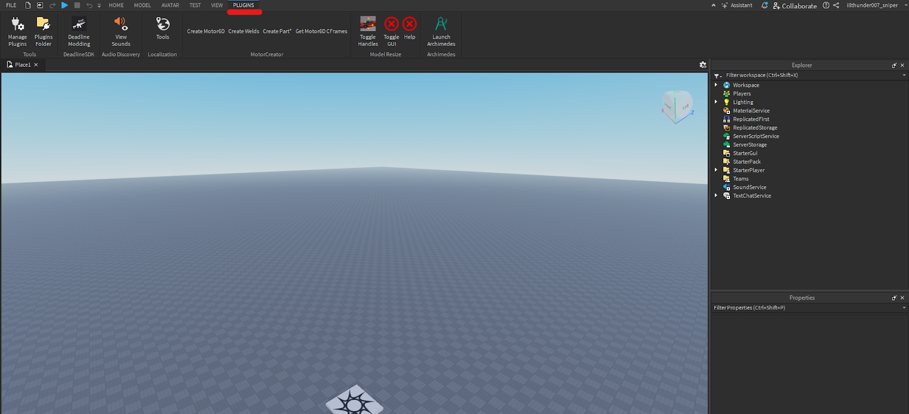
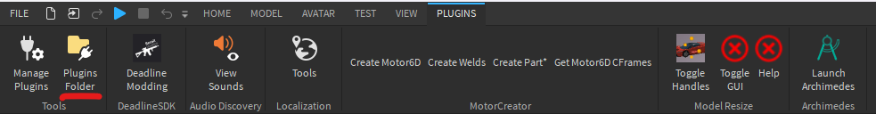
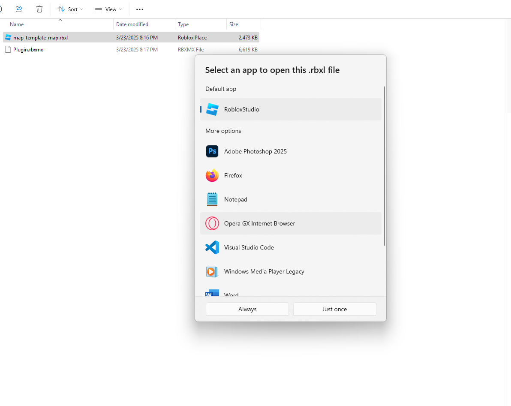
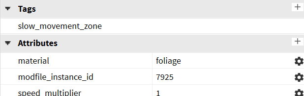
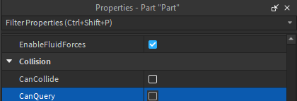
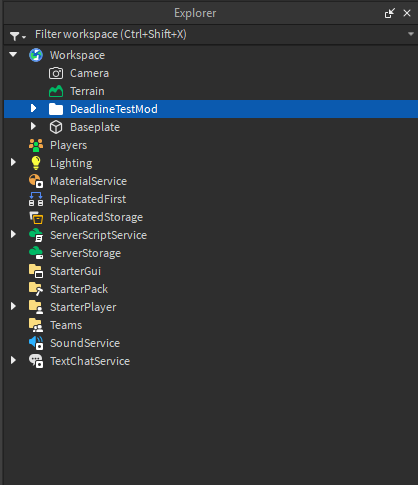

# Index

Scripts are written in barebones Luau with Deadline-only globals (game is replaced with game modules). Modfiles are developed in Roblox Studio, so download that if you want to make maps

## How-to

To make mods in Deadline you need the deadline plugin([download here](https://github.com/recoil-group/deadline-modfile-plugin/releases/download/0.23.0-dev-3-5/Plugin.rbxmx)) and an example map([download here](https://recoil-group.github.io/deadline-modding/example/source/map_template_map.rbxl)).

## Setup

-   Open roblox studio
-   Click on any of the presets below 
-   Click on the PLUGINS tab 
-   Then click on Plugins folder 
-   Open your downloads folder and drag the plugin into the newly opened folder 
-   Now close the plugin folder and roblox studio
-   Right click on the example map file and select “Open with": 
-   Select always, now the example map is open.
-   Doubleclick “Workspace” on the right of the screen 
-   Click on “Camera” once
-   In the properties explorer scroll down
-   Click on “CameraType” and select “Custom” 
-   Setup is done

## Modifying the map

Note: The map will not work if you don’t include the info folder

Any new blocks or map pieces you want to add need to be moved into the “map” folder. Remember you can’t export regular meshes, only special ones. For more info on special meshes look [here](https://create.roblox.com/docs/reference/engine/classes/SpecialMesh). Other things you can't export include: terrain, custom material variants, SurfaceAppearance, Particle Emitters. 

Under the ignore folder you can find various other folders. By placing parts into defender_spawn>default (Syno) or attacker_spawn>default (Anto) players will spawn on a random point of those parts.

To create parts that allow bullets to pass through but not players create a new folder under ignore called “map_ignore” and move the parts in there.

The restricted folder contains spawn protection, if a player is inside those parts they won’t get killed.

The gamemode folder houses the blocks that determine where the points are located for KOTH and domination. The capture points’ names start from zero, you can have any amount.

Parts under Slowzones are supposed to be water and bushes, this is what their properties should look like

Bushes:

Water:

If you want to disable collision for parts disable canCollide **AND** canQuery, if you only disable the former your game will break

## Using the plugin

-   Open the plugins tab again (see Setup step 3)
-   Click on the Deadline Modding plugin 
-   This will appear 
-   Select the mod folder in the explorer 
-   Click on “export selected instance” 
-   Copy the link
-   Join your deadline private server
-   Press ` on your keyboard
-   The following menu will come up:   
-   Click on Server Luau Console   
-   Type in `require(“paste the link here”)`

    > example: `require(“https://deadlinegame.com/api/mod/get/370b7c25-cf14-424b-b3f1-9154c7c616a8”)`
    > Remember this link is a one time use, to export the map again repeat these last steps or save the file.

-   This will come up   

-   To use your map type: `map.set_map('template_map')`. Make sure template_map is written between ' or "

## Reference

-   For scripting please refer to the [api](https://recoil-group.github.io/deadline-modding/making-mods/scripting/api/). All code can be run in the server console.
-   For other example mods look [here](https://recoil-group.github.io/deadline-modding/mod-list/), and you can find info on interactables [here](https://recoil-group.github.io/deadline-modding/making-mods/mapping/interactables/).
